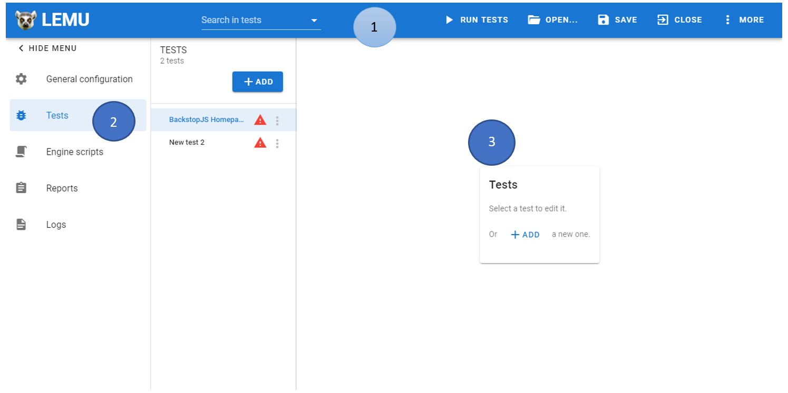

# Navigating around LEMU

## Start screen

When you open Lemu, it will present you with a screen allowing to either open an existing BackstopJS json configuration file or create a new one.

If you create a new one, you will need to select a directory where the configuration file will be created.

If you want to open an existing one, just choose the "backstop.json" file you want.

## Configuration screen
The configuration section will allow you to edit your configuration file.

Here is what you will see when you open a configuration file.

In the application toolbar (1) you will be able to:
 - search for a test with the search box
 - save your tests
 - run your tests (all of them)
 - close the current open configuration
 - have more information about the application

On the left menu (2), you will be able to go the different section:
 - General configuration: To see and edit BackstopJS high level configuration (engine, viewports, etc.). [More info](/guide/general-configuration)
 - Tests: list and edit your test scenarios. [More info](/guide/test-view)
 - Report: to see the last Backstop report. [More info](/guide/report)
 - Engine scripts: to list and manage your scripts used by your tests. [More info](/guide/engine-scripts)
 - Logs: Logs of the BackstopJS test run in Lemu. [More info](/guide/logs)

The center of the screen (3) contains the ressource you are currently watching.

You can now learn how to [write your first test](/guide/write-first-test)