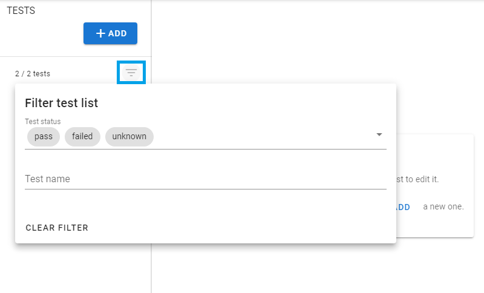

# Test view
The test view is divided in two parts. On the left, you have the menu to select your tests, and on the right the currently selected test.

From the menu you can add new test, by clicking on the "add button" on top. Alongside each test on the right, the status of the test is displayed along with a "..." button which allows you to select an action to execute on this test. From there, you can:
- run the test
- approve the test
- duplicate the test
- delete the test

You can filter your tests to find them easily.

You can select your test by clicking on it in the menu. 

After clicking on one it will open in the right part.

On top you have the action bar for your test. On the left is the test name. On the right are four buttons:
- "play" button allows you to run this test
- "checkmark" button will approve all the result for this test
- "copy" button will duplicate this test
- "bin" button will delete this test

Below that you got tabs allowing to edit your [test configuration](/guide/test-configuration) or see the results and references for this test in the [test result section](/guide/test-result).